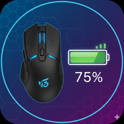
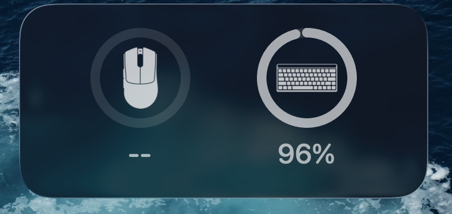

# Peripheral Battery

<p align="center">
  
</p>

<p align="center">
  A clean macOS menu bar battery monitor with desktop widgets for a
  <strong>Razer DeathAdder V3 Pro</strong> and a
  <strong>ROG Falchion RX Low Profile</strong>.
</p>

<p align="center">
  
  
  
</p>

Peripheral Battery keeps the two numbers you actually care about visible all the time:
your mouse battery and your keyboard battery. The host app lives in the macOS menu bar,
handles device polling and notifications, and feeds a lightweight WidgetKit extension for
desktop widgets.

## Preview



The widget is designed to stay minimal on the desktop while still making battery state
glanceable. The current build supports both `small` and `medium` widget families.

## Highlights

- Live battery reading for the Razer DeathAdder V3 Pro in the macOS menu bar
- Live battery reading for the ROG Falchion RX Low Profile in 2.4GHz mode
- Small and medium desktop widgets backed by the same shared snapshot data
- Low-battery notifications when a device drops to 20% or below
- Charging detection for the mouse when USB-C power is connected
- Manual refresh from the menu bar plus automatic periodic refresh
- Reconnect handling for wake-from-sleep and device hotplug events
- Clean desktop-focused widget styling with custom device icons

## Supported Devices

- `Razer DeathAdder V3 Pro`
- `ROG Falchion RX Low Profile`
- `ROG Omni Receiver` for keyboard battery reporting in 2.4GHz mode

## How It Works

1. The menu bar app polls supported devices using native macOS APIs and USB/HID access.
2. The latest battery snapshot is written into the shared App Group container.
3. The WidgetKit extension reads the same snapshot and renders the desktop widget.

The shared App Group identifier used by the project is `group.com.young.peripheralbattery`.

## Permissions

The Razer mouse battery path uses direct USB control transfers.

The ROG Falchion battery path depends on the Omni Receiver HID interrupt report, so macOS
requires `Input Monitoring` permission before the keyboard battery can be read reliably in
2.4GHz mode.

Enable it here after the first launch:

`System Settings -> Privacy & Security -> Input Monitoring`

If you change the permission, quit and reopen the app once.

## Build

### Native Binary

```sh
make
```

This builds the standalone menu bar binary.

### App Bundle With Widget

```sh
./build_app.sh
```

This is the recommended path when you want the full macOS app bundle with the embedded widget
extension.

### Xcode Project

Open `PeripheralBattery.xcodeproj` in Xcode and run the `PeripheralBattery` scheme.

The project contains two targets:

- `PeripheralBattery` for the menu bar host app
- `PeripheralBatteryWidgetExtension` for the desktop widget

Before the first successful widget run in Xcode:

1. Set your Apple team for both targets.
2. Enable the App Group `group.com.young.peripheralbattery` for both targets.
3. Run the app once and grant `Input Monitoring` if macOS prompts for it.
4. Add the widget from the macOS desktop widget picker.

For command-line compile verification without signing:

```sh
xcodebuild -project PeripheralBattery.xcodeproj \
  -scheme PeripheralBattery \
  -configuration Debug \
  -derivedDataPath build/XcodeDerived \
  CODE_SIGNING_ALLOWED=NO \
  build
```

## Install

1. Build the app bundle with `./build_app.sh` or from Xcode.
2. Move `PeripheralBattery.app` into `/Applications`.
3. Open the app once.
4. Grant `Input Monitoring` if you want keyboard battery reporting.
5. Add the desktop widget from the widget picker.

If you are iterating on the widget design, removing the old widget instance and re-adding it is
often the fastest way to force macOS to pick up a fresh extension build.

## Project Layout

```text
src/        Native menu bar app and device polling
Widget/     WidgetKit views, timeline store, icons, and widget assets
build_app.sh
Makefile
```

## Credits

This repo is a trimmed adaptation of `uffiulf/razer-battery-status-macos`, narrowed down to the
battery-monitoring path and rebuilt with a cleaner widget-focused desktop presentation.
