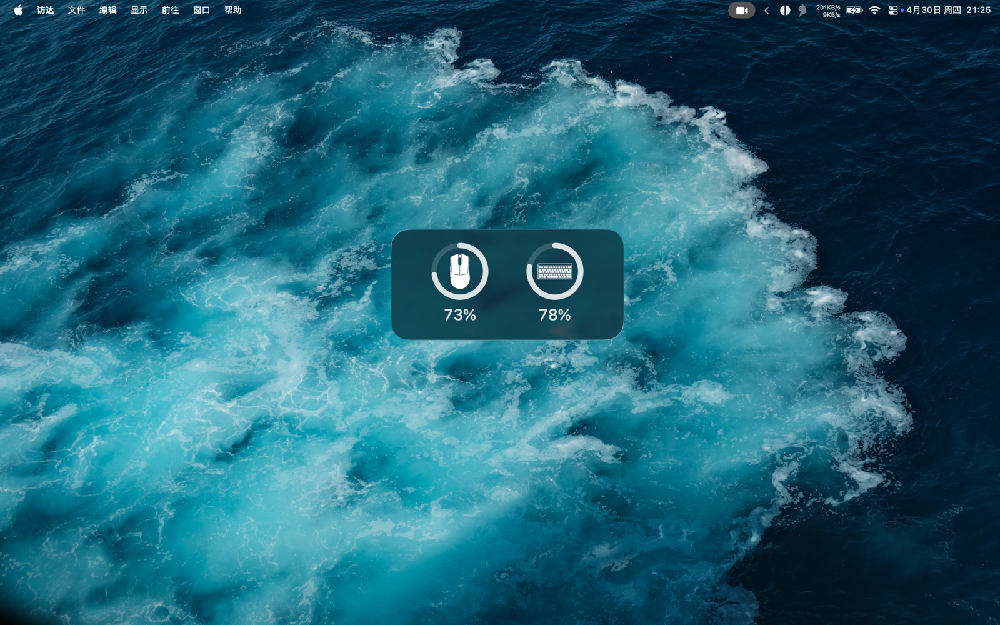

# Peripheral Battery

<p align="center">
  
</p>

<p align="center">
  A clean macOS menu bar battery monitor with desktop widgets for a
  <strong>Razer DeathAdder V3 Pro</strong> and a
  <strong>ROG Falchion RX Low Profile</strong>.
</p>

<p align="center">
  
  
  
</p>

Peripheral Battery keeps the two numbers you actually care about visible all the time:
your mouse battery and your keyboard battery. The host app lives in the macOS menu bar,
handles device polling and notifications, and feeds a lightweight WidgetKit extension for
desktop widgets.

## Project Basis

This project is based on `uffiulf/razer-battery-status-macos` for the original Razer battery
monitoring direction, then narrowed down into a cleaner menu bar app plus WidgetKit desktop
widget focused on just a few daily-use peripherals.

The current Razer battery path is reimplemented in native macOS IOKit code and keeps only the
battery and charging pieces the app needs. The ASUS keyboard path is a separate integration built
around the ROG Omni Receiver HID report flow used by the Falchion RX Low Profile in 2.4GHz mode.

## Preview



The widget is designed to stay minimal on the desktop while still making battery state
glanceable in the actual menu bar and desktop setup. The current build supports both
`small` and `medium` widget families.

## Highlights

- Live battery reading for the Razer DeathAdder V3 Pro in the macOS menu bar
- Live battery reading for the ROG Falchion RX Low Profile in 2.4GHz mode
- Small and medium desktop widgets backed by the same shared snapshot data
- Low-battery notifications when a device drops to 20% or below
- Charging detection for the mouse when USB-C power is connected
- Manual refresh from the menu bar plus automatic periodic refresh
- Reconnect handling for wake-from-sleep and device hotplug events
- Clean desktop-focused widget styling with custom device icons

## Supported Devices

- `Razer DeathAdder V3 Pro`
  Wireless dongle mode is supported for battery reads, and wired mode is used to detect charging.
- `ROG Falchion RX Low Profile`
  Battery reporting is supported in 2.4GHz mode through the ROG Omni Receiver path currently
  implemented in the app.
- `ROG Omni Receiver` with product ID `0x1ACE`
  This is the receiver path the keyboard integration is built against.

Not currently implemented:

- Other Razer mice, even if they are close relatives, still need their own verified product IDs
  and protocol confirmation.
- Other ASUS or ROG keyboards still need their own captured HID traffic and response parsing.
- Bluetooth-specific battery paths are not implemented in this repo.

## Adding Another Device

Adding a new device is mostly protocol reverse-engineering work rather than UI work.

1. Identify the transport first.
   Confirm whether the device reports battery over USB control transfers, HID output/input
   reports, a receiver dongle, or a wired-only path.
2. Capture the vendor traffic on Windows.
   In practice this is often the fastest route because the official vendor software usually
   exposes the proprietary battery query path there first. A common setup is `Wireshark` with
   `USBPcap` for USB traffic, then triggering battery refreshes, charge-state changes, or
   wireless-mode changes while recording.
3. Extract the protocol constants.
   You need the vendor and product IDs, interface number, report ID, request bytes, expected
   response shape, checksum or framing rules, and the exact byte that maps to battery percent.
4. Reproduce the query on macOS.
   For Razer-style USB control transfers, extend [`src/RazerDevice.cpp`](/Users/young/Coding/PeripheralBattery/src/RazerDevice.cpp)
   and [`src/RazerDevice.hpp`](/Users/young/Coding/PeripheralBattery/src/RazerDevice.hpp). For
   receiver-driven HID devices similar to the Falchion path, start from
   [`src/main.mm`](/Users/young/Coding/PeripheralBattery/src/main.mm).
5. Use the local probe tools before wiring it into the app.
   [`tools/rog_probe.mm`](/Users/young/Coding/PeripheralBattery/tools/rog_probe.mm) and
   [`tools/rog_usb_probe.mm`](/Users/young/Coding/PeripheralBattery/tools/rog_usb_probe.mm) are
   useful for checking report sizes, interfaces, and raw replies on macOS before you add app UI
   logic.
6. Finish the app-facing integration.
   After the protocol is stable, add the new device name, widget presentation, and any custom
   icon or snapshot handling needed by the menu bar app and widget extension.

## How It Works

1. The menu bar app polls supported devices using native macOS APIs and USB/HID access.
2. The latest battery snapshot is written into the shared App Group container.
3. The WidgetKit extension reads the same snapshot and renders the desktop widget.

The shared App Group identifier used by the project is `group.com.young.peripheralbattery`.

## Permissions

The Razer mouse battery path uses direct USB control transfers.

The ROG Falchion battery path depends on the Omni Receiver HID interrupt report, so macOS
requires `Input Monitoring` permission before the keyboard battery can be read reliably in
2.4GHz mode.

Enable it here after the first launch:

`System Settings -> Privacy & Security -> Input Monitoring`

If you change the permission, quit and reopen the app once.

## Build

### Native Binary

```sh
make
```

This builds the standalone menu bar binary.

### App Bundle With Widget

```sh
./build_app.sh
```

This is the recommended path when you want the full macOS app bundle with the embedded widget
extension.

### Xcode Project

Open `PeripheralBattery.xcodeproj` in Xcode and run the `PeripheralBattery` scheme.

The project contains two targets:

- `PeripheralBattery` for the menu bar host app
- `PeripheralBatteryWidgetExtension` for the desktop widget

Before the first successful widget run in Xcode:

1. Set your Apple team for both targets.
2. Enable the App Group `group.com.young.peripheralbattery` for both targets.
3. Run the app once and grant `Input Monitoring` if macOS prompts for it.
4. Add the widget from the macOS desktop widget picker.

For command-line compile verification without signing:

```sh
xcodebuild -project PeripheralBattery.xcodeproj \
  -scheme PeripheralBattery \
  -configuration Debug \
  -derivedDataPath build/XcodeDerived \
  CODE_SIGNING_ALLOWED=NO \
  build
```

## Install

1. Build the app bundle with `./build_app.sh` or from Xcode.
2. Move `PeripheralBattery.app` into `/Applications`.
3. Open the app once.
4. Grant `Input Monitoring` if you want keyboard battery reporting.
5. Add the desktop widget from the widget picker.

If you are iterating on the widget design, removing the old widget instance and re-adding it is
often the fastest way to force macOS to pick up a fresh extension build.

## Project Layout

```text
src/        Native menu bar app and device polling
Widget/     WidgetKit views, timeline store, icons, and widget assets
build_app.sh
Makefile
```

## Credits

- Original Razer battery-monitoring direction from `uffiulf/razer-battery-status-macos`
- This repo's macOS menu bar app, widget integration, and multi-device adaptation are specific to
  Peripheral Battery
